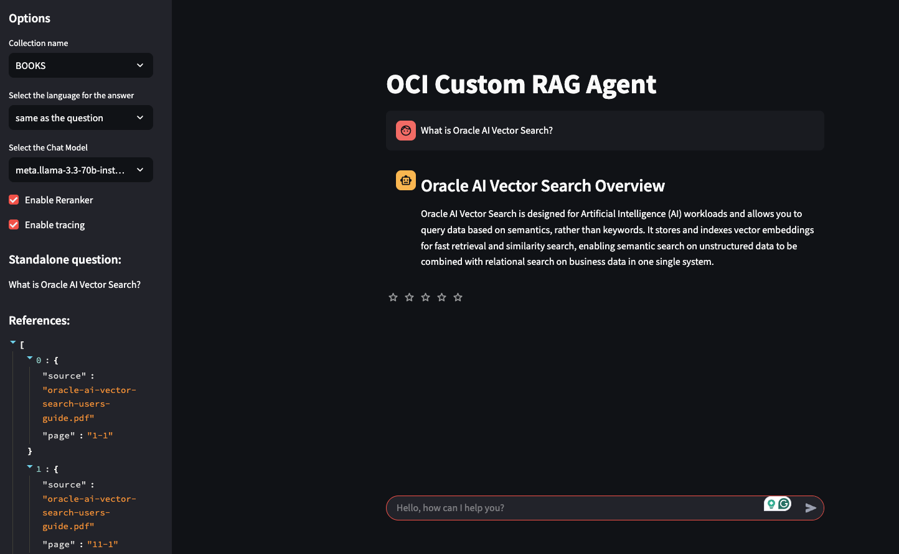

# Custom RAG Agent
This repository contains a customizable **RAG agent** built with **LangGraph**, **OCI Generative AI**, and **Oracle 23AI Vector Search**.

**Author**: L. Saetta  
**Reviewed**: 2026-03-01



## When to use this asset
Use this project as a reference implementation when you need:
- A modular, production-oriented RAG workflow
- OCI-hosted LLM and embedding model integration
- Oracle 23AI as the vector store
- A Streamlit UI for interactive testing

## Design and implementation
- The orchestration layer is implemented with **LangGraph**
- Vector search is implemented with **LangChain** on Oracle 23AI
- A **reranker** step can refine retrieved chunks before answer generation

## Project structure
```text
.
├── agent/                  # LangGraph agent workflow + nodes
│   ├── rag_agent.py
│   ├── agent_state.py
│   ├── intent_classifier.py
│   ├── query_rewriter.py
│   ├── vector_search.py
│   ├── session_vector_search.py
│   ├── hybrid_search.py
│   ├── reranker.py
│   ├── answer_generator.py
│   ├── content_moderation.py
│   └── prompts.py
├── core/                   # Shared models/utilities/data helpers
│   ├── oci_models.py
│   ├── custom_rest_embeddings.py
│   ├── citation_utils.py
│   ├── db_utils.py
│   ├── rag_feedback.py
│   ├── retry_utils.py
│   ├── session_pdf_vlm.py
│   ├── transport.py
│   ├── chunk_index_utils.py
│   ├── bm25_search.py
│   └── utils.py
├── docs/
│   └── README.md           # Uploaded PDF flow and hybrid retrieval notes
├── assistant_ui_langgraph.py
├── rag_agent_api.py
├── pages/
└── tests/
```

## Design decisions
- Each graph node is implemented as a dedicated Python class (Runnable pattern)
- Reranking is currently LLM-based; alternative rerankers can be plugged in
- Observability is integrated with **OCI APM** (via `py-zipkin`)
- The UI is implemented with **Streamlit**

## Streaming behavior
- The UI receives and renders intermediate agent events (vector search, reranking, etc.)
- Reference links can appear before the final answer is completed
- Final answer tokens are streamed

## LLM retry behavior
- Retries are enabled for reranker and final answer generation.
- Retries are bounded by `LLM_MAX_RETRIES` in `config.py` (default: `2`).
- Retry is attempted only for likely transient errors (for example: content/safety filter false positives, rate limit, timeout, and 5xx-style failures).
- Backoff uses short exponential waits with jitter: about `1s`, then `2s` for additional attempts.
- For streamed answers, retry is applied only if failure happens before the first token is emitted (to avoid duplicated partial output).

## Status
This project is actively evolving and is considered **WIP**.

## References
- [Integration with OCI APM](https://luigi-saetta.medium.com/enhancing-observability-in-rag-solutions-with-oracle-cloud-6f93b2675f40)

## Why an Agentic Approach
One primary advantage of an agentic architecture is **modularity**.  
Real-world requirements usually go beyond simple RAG demos. With **LangGraph**, features can be added as isolated steps in the workflow without rewriting the whole pipeline.

Example: if answers must redact PII from retrieved content, you can append a dedicated post-processing node that detects and anonymizes sensitive data.

## Configuration
### 1) Python environment
1. Use `Python 3.11`.
2. Create and activate a virtual environment.
3. Install dependencies:

```bash
pip install -r requirements.txt
```

### 2) Public configuration (`config.py`)
`config.py` contains shared runtime settings:
1. OCI regions and endpoints:
   - `LLM_REGION`
   - `EMBED_REGION`
   - `LLM_SERVICE_ENDPOINT`
   - `EMBED_SERVICE_ENDPOINT`
2. Model settings:
   - `LLM_MODEL_ID`
   - `VLM_MODEL_ID` (used for in-session scanned PDF OCR on main UI page)
   - `EMBED_MODEL_TYPE`
   - `EMBED_MODEL_ID`
   - `RERANKER_MODEL_ID`
   - `LLM_MAX_RETRIES`
   - `SESSION_PDF_MAX_PAGES` (guardrail for in-memory PDF scan)
3. Retrieval behavior:
   - `TOP_K`
   - `COLLECTION_LIST`
   - `DEFAULT_COLLECTION`
   - `BM25_CACHE_DIR` (directory for serialized BM25 cache file; default `bm25_cache`)
4. Citation links:
   - `CITATION_BASE_URL` (env-overridable, default `http://127.0.0.1:8008/`)

### 3) Private configuration (`config_private.py`)
Create `config_private.py` from `config_private_template.py`, then set:
1. `VECTOR_DB_USER`
2. `VECTOR_DB_PWD`
3. `VECTOR_WALLET_PWD`
4. `VECTOR_DSN`
5. Wallet location (`VECTOR_WALLET_DIR` can be auto-resolved or forced via env var `VECTOR_WALLET_DIR`)

Docker mount path for this file:
- `/app/config_private.py`

### 4) OCI CLI configuration
The project expects OCI credentials from your local OCI directory:
1. Ensure `${HOME}/.oci/config` exists.
2. Ensure `key_file` paths are valid from inside the mount.
3. The default profile in compose is `DEFAULT`.

### 5) Citation image server (UI references)
When running with Docker Compose, a Python static server exposes citation PNG files on port `8008`.

Expected directory structure:

```text
<citation_root>/<document_name_without_pdf>/page0001.png
```

Example:

```text
/Users/lsaetta/Progetti/work-iren/pages/MyDoc/page0007.png
```

### 6) Docker deployment details
For complete Docker deployment instructions (services, mounts, ports, health checks), see:
- [deployment/docker/README.md](./deployment/docker/README.md)

### 7) BM25 cache persistence directories
Repository-local directories are used for persisted BM25 cache files:
- `bm25_cache/ui`
- `bm25_cache/mcp`

In Docker Compose these are mounted respectively to `/app/bm25_cache` in:
- `custom-rag-agent-ui`
- `bm25_mcp_server`

## License
This project is licensed under the **MIT** License.

See [LICENSE](./LICENSE)

## New Features (2026-03)
- Added an intent-classification branch in the graph (`GLOBAL_KB`, `SESSION_DOC`, `HYBRID`) implemented as a dedicated Runnable node.
- Added a dedicated intent model setting in `config.py` (`INTENT_MODEL_ID`).
- Added session-only retrieval node (`SessionVectorSearch`) for in-memory uploaded PDF search.
- Completed HYBRID retrieval behavior with a safe additive strategy:
  - merge DB candidates (semantic + BM25) with a conservative number of session-PDF chunks;
  - deduplicate merged chunks before reranking;
  - configurable session contribution via `HYBRID_SESSION_TOP_K`.
- Improved references for uploaded PDFs:
  - metadata now uses the real uploaded filename (not temporary file name);
  - session-PDF references in UI show source/page without link.
- Added/updated tests for:
  - intent classifier behavior;
  - hybrid merge behavior;
  - workflow routing (GLOBAL_KB / SESSION_DOC / HYBRID) with pytest mocks.
- Added consolidated docs for uploaded PDF handling and hybrid retrieval in `docs/README.md`.
